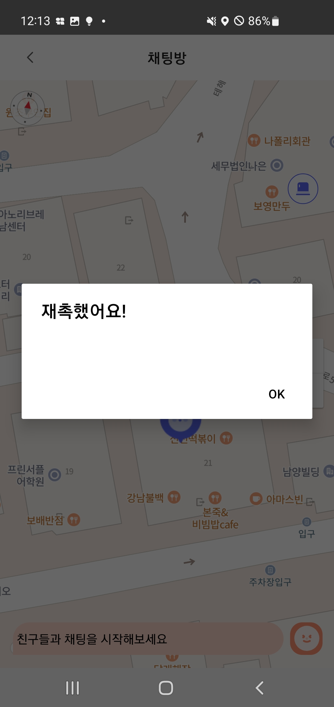
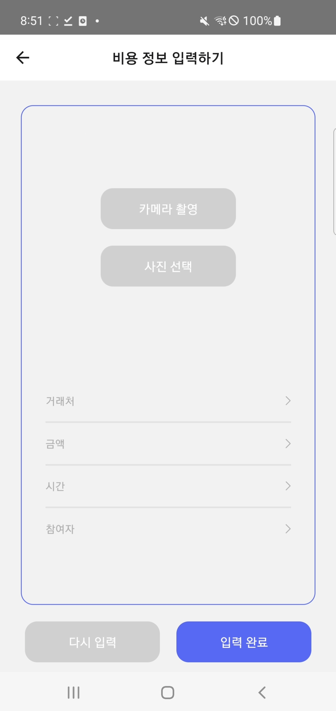
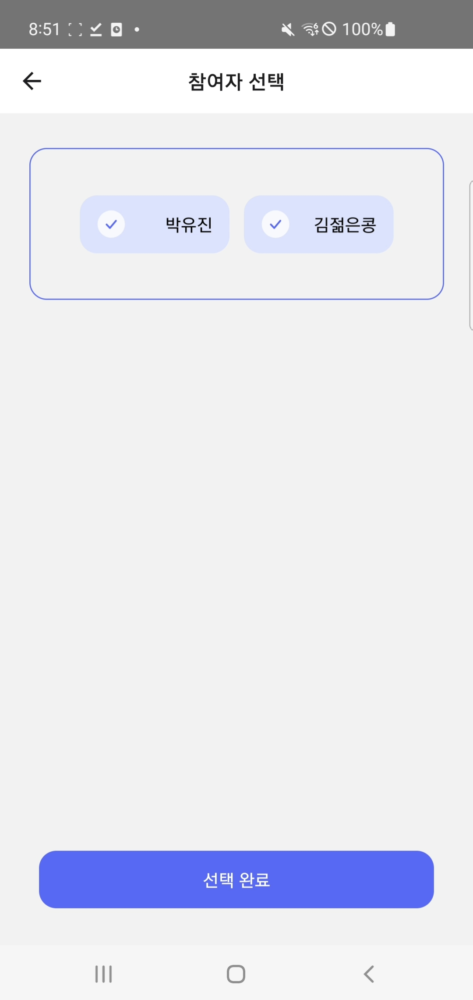
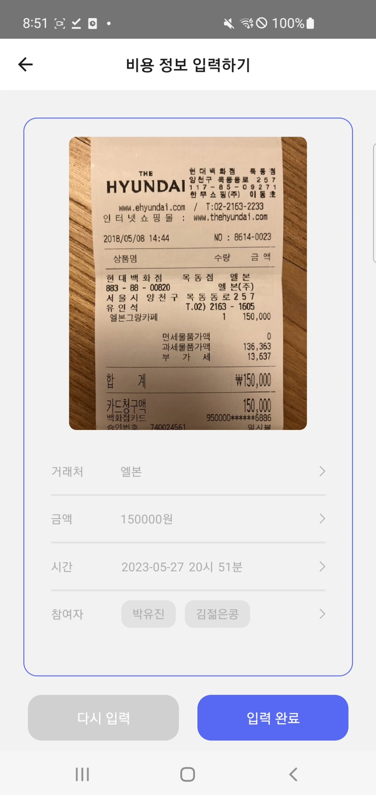
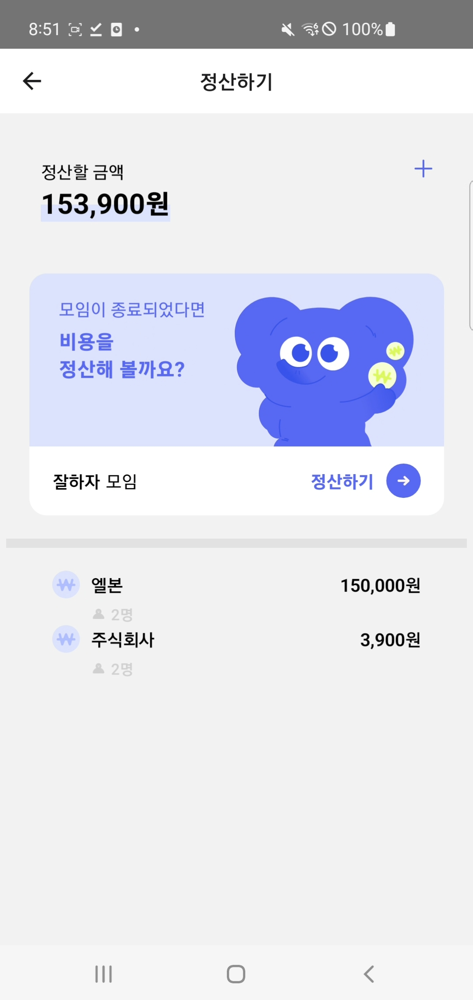
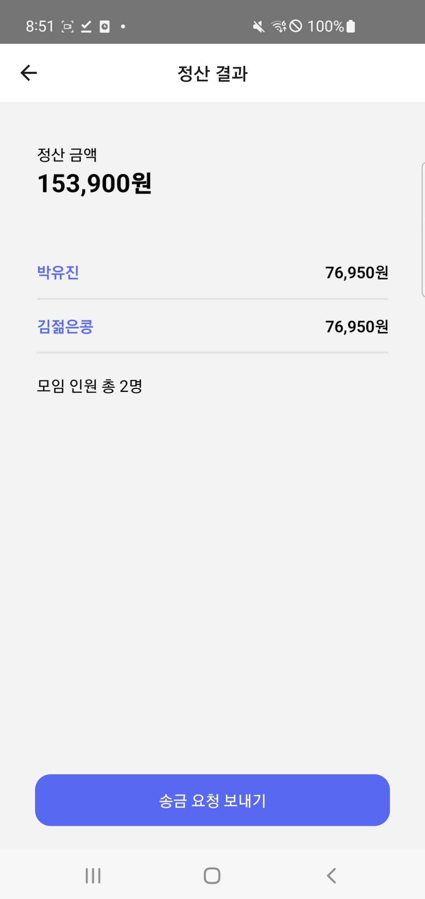
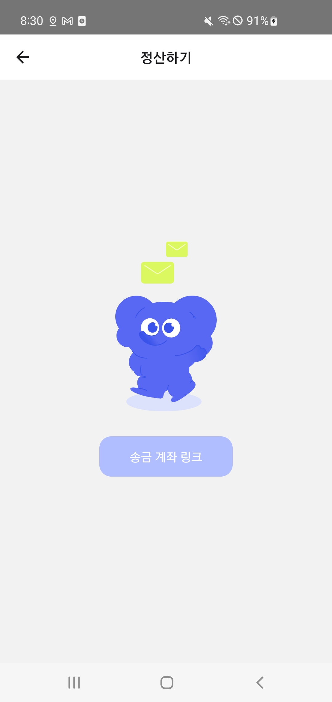

### 📋 프로젝트 개요

> 프로젝트명 : 끼리
개발 기간 : 2023년 04월 10일 ~ 2023년 05월 20일 (6주)
분류 : 팀 프로젝트
팀 구성 : 프론트엔드 3명, 백엔드 3명
> 

### 🧑‍🤝‍🧑 팀 정보

| 이름 | 역할 |
| --- | --- |
| 유한별 | 팀장, FE 개발 |
| 이은지 | FE 개발 |
| 박유진 | FE 개발 |
| 김영빈 | BE 개발 |
| 김준호 | 부팀장, BE 개발 |
| 이지영 | BE 개발, CI/CD |

### 🔍 기획 배경

> **모임을 더 즐겁게, 가는 길이 더 즐겁게**
> 

실시간 사용자 인터랙션을 더한 모임 관리 어플리케이션

### 우리의 Needs

- 친구들과 특정 장소에서 만날 때 친구들이 잘 오고 있는지 늦진 않는지 실시간으로 확인하고 싶다.
- 약속 시간에 늦는 친구들에게 패널티를 주고 싶다.
- 정산을 간편하게 하고 싶다.

### 솔루션

" 실시간 위치 공유 "

- 친구들과 실시간 위치를 공유하며 채팅, 이모티콘을 통해 상호작용 가능
- 약속 장소에 도착하는 시간을 기록해 지각하는 친구에게 지각비 적용

" AR 길 안내 "

- 길을 헤메는 친구에게 지도 상에 길을 그려주면 AR로 그 길을 따라 이동

" 간편 정산 "

- 정산에 필요한 정보를 최소한으로 기입하면 자동으로 비용 계산

### ⚙️ 핵심 기능

> **실시간 위치 공유**
> 
- 모임 1시간 전부터 친구들과 실시간 위치를 공유할 수 있습니다.
- 모임 장소 반경 50m에 도착 시 도착 순서를 알려드립니다.

> **즉각적인 상호 작용**
> 
- 실시간 채팅과 이모티콘 전송으로 상호작용 할 수 있습니다.
- 지도 상에서 친구 위치를 눌러 재촉 알림을 전송해 보세요.

> **친구가 그려주는 AR 지도**
> 
- 길을 헤메는 친구들에게 지도 상에 길을 그려주세요.
- 도움을 요청한 친구는 2D, 3D, AR 경로를 참고하여 모임 장소로 이동할 수 있습니다.

### 💡 주요 기능

1. 홈
    - 지난/예정된 모임을 카드 단위로 시각화하여 관리
2. 실시간 위치 공유
    - WebSocket으로 사용자의 위치 정보 공유
    - 현재 위치 표시
3. AR 길 안내
    - Naver Maps API를 사용해 이동 경로 그리기
    - Viro를 사용해 AR 화면 상에서 경로 확인
4. 상호 작용
    - WebSocket으로 채팅 및 이모티콘 전송
    - 친구 위치를 누르면 재촉 알람 전송
5. 간편 정산
    - 네이버 CLOVA OCR을 사용해 영수증 인식
6. 마이페이지
    - 지난 모임/만난 친구들 통계 및 랭킹

### 🎨 기능 상세 및 구현 화면

### 1) 홈

### 2) 모임 생성

### 3) 위치 공유

### 4) 길 안내

.gif)

.gif)

### 5) 채팅/이모티콘

.gif)

.gif)

### 6) 알림

.gif)

### 7) 간편 정산

.gif)

정산하기.gif

### 8) 설정 및 마이페이지

### ⚙ 아키텍처 구조도

