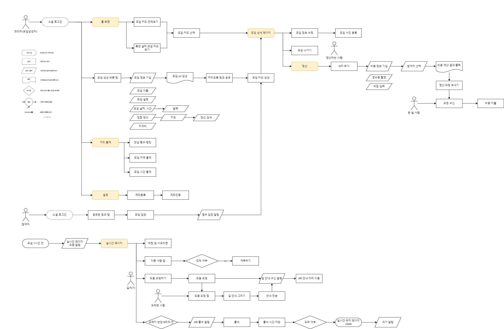

# 끼리 기획서

## 0. 팀 소개

| 이름 | 역할 | 기술 |
| --- | --- | --- |
| 유한별 | 팀장. FE | React Native Typescript |
| 김준호 | 부팀장. BE | Spring Boot MariaDB Redis  |
| 김영빈 | BE. | Spring Boot MariaDB MongoDB Redis AWS S3 |
| 박유진 | FE | React Native TypeScript  |
| 이지영 | BE. CI/CD | Spring Boot MariaDB MongoDB AWS EC2 Docker Jenkins |
| 이은지 | FE, UI/UX | React Native Typescript  |

## 1. 서비스 소개

<aside>
📍 모임을 위한 실시간 위치 공유 서비스

</aside>

### 서비스 개요

- 서비스 이름
    - 끼리
- 타겟
    
    > 10 ~ 20대
    > 
    
- 목적
    - 모임을 **재미**있고 **간편**하게
- 서비스 내용
    - 모임 생성자는 모임 링크를 카카오톡 단톡방에 공유하여 간편하게 구성원들을 초대할 수 있다.
    - 사용자들은 모임 전에 지도에 표시된 친구들의 실시간 위치를 확인하며 의사소통 할 수 있다.
    - 약속시간에 늦는 친구들은 지각비를 내고, 늦지 않은 친구들은 정산시 돈을 덜 낸다.
    - 사용자는 모임 후, 경비 정산 시 영수증을 찍고 각 N차마다 참여 인원을 기입하면 자동으로 비용을 계산받을 수 있다.

### 기획 배경

> 왜 이 서비스가 필요한가?
> 
- 친구들과 특정 장소에서 만날 때 친구들이 잘 오고 있는지 늦진 않는지 실시간으로 확인하고 싶다.
- 약속 시간에 늦는 친구들이 패널티를 받고, 제 시각에 온 사람들은 이득이 있었으면 좋겠다. (?)
- 귀찮은 정산을 간편하게 하고 싶다.

### 메인 컨셉

> 모임을 더 **재미**있고 **간편**하게
> 

### 차별점

> **모임을 카드단위로 관리**
> 
- 예정된 모임을 카드단위로 시각화하여 관리

> **실시간 위치 공유**
> 
- 모임 전 친구들과 실시간 위치를 공유하며 실시간 채팅, 이모티콘 상호작용하는 재미

> **간편 정산**
> 
- 모임 후 정산에 필요한 정보를 최소한으로 간편하게 기입하면 자동으로 비용 계산
    - 네이버 클로바 OCR

> **AR**
> 
- 길을 헤메는 친구들에게 지도 상에 길을 그려주면 AR로 그 길을 따라 이동
    
    
    

### 주요 기능

1. 모임 생성 및 퇴장 
    - 생성된 모임카드의 url 공유하기
    - url을 통해 친구들 입장
    - 모임 참석 여부에 변동이 생겼을 때 모임 퇴장
2. 모임 설정 
    - 집합 장소 설정 (지도에 핀 찍기)
    - 지각비 설정
3. 실시간 위치 공유 `mvp`
    - 실시간 위치 공유창 생성 : 모임 한 시간 전에 홈화면에 실시간 위치 공유창 생성
        - 각 사용자를 귀여운 동물 이모지로 표시
    - 생성과 동시에 참여자들에게 알림
    - 모두 만나면 (모두 출석처리됐을 때) 실시간 위치 공유 종료
    - 실시간 위치 공유 종료에 대한 알림
4. 출석 및 지각
    - 도착 순서와 도착 시간을 보여주는 랭킹 표시
5. 채팅, 이모티콘 리액션 `mvp`
    - 실시간 채팅 메시지 보내기
    - 이모티콘을 눌러 내 리액션 보내기
6. 다른 사람을 눌러 재촉하기 `mvp`
    - 상대 동물 이모지를 누르면 상대방에게 재촉 알림
7. 다른 사람을 눌러 길 알려주기 `mvp`
    - 옵션 1 : 도착한 사람이 그려준 길을 AR을 보면서 이동
        - 도움을 요청한 사람을 눌러 길 알려주기 선택 (1:1 매칭)
        - 상대의 위치와 내 위치가 표시된 지도 위를 드래그하여 길을 생성
        - 상대에게 화면내에 모달로 메시지(?) 도착 (000님이 000님에게 길 정보를 보냈어요?)
        - 모달 클릭하면 AR화면으로 바뀌고 상대가 그려준 길이 화면에 보인다
    - 옵션 2 : 헤매는 사람에게 화상 라이브 요청
8. 도착지에서 상호작용 `mvp`
    - (차후 논의 필요)
    - 일단 집합 장소 반경 N 미터 내에 들어올 경우 자동 출석 체크
9. 정산 - 비용 계산
    - N차마다 영수증을 추가하고 정산해야할 내용 입력
    - N차마다 참여자를 선택하고 나면 자동으로 참여자들에게 비용을 지불할 링크와 지불할 비용 정보가 함께 정산 요청 알림
    - 정산이 늦어지면 정산 재촉하기, 리마인드
10. 정산 - 비용 지불
    - 정산 알림을 누르면 지불할 비용과 비용을 지불할 코드송금링크가 도착
11. 귀가
    - 집 주소 반경 N 미터 내에 들어올 경우 “집에 거의다 도착했어요” 알림 전송
12. 마이페이지
    - 지각 횟수, 지각비
    - 친구들 만남 횟수 랭킹
    - 친구들과 모인 장소 랭킹
    - 친구들과 만난 시간 통계
    - ‘오전파’, ‘점심파’, ‘저녁파’, ‘야간파’ 등으로 많이 만난 시간대에 따라 분석

### 유저 플로우

1. 모임생성
    - 모임생성자
        - 모임 생성하기 버튼을 누른다.
        - url이 생성된다.
        - 생성된 url을 ‘카카오톡을 공유하기’ 혹은 ‘링크 복사’를 한다.
        - url이 카카오톡에 보내진다. (혹은 붙여넣는다.)
    - 모임초대자
        1. 카카오톡에 공유된 링크를 누른다.
        
        2.1 사용자의 디바이스에 끼리 앱이 없다 → 플레이스토어로 리다이렉트 → 앱 설치 후 카카오톡에 공유된 링크 재클릭
        
        2.2 앱으로 연결 후 로그인 정보가 없다 → 로그인 화면으로 리다이렉트 → 공유된 url로 재이동 & 모임카드 생성
        
        2.3 앱으로 연결 후 로그인 정보가 있다 → 새로운 모임 카드 생성
        
2. 약속 1시간 전 실시간 위치 공유
    - 모든 유저에게 익명으로 실시간 위치를 공유한다.
    - 모든 유저와 실시간으로 채팅을 할 수 있다.
    - 단순한 이모지를 통해 리액션할 수 있다.
3. 길 알려주기
    - 길을 알려주는 사람
        1. 도움을 요청한 사람의 아이콘을 클릭한다.
        2. ‘길 알려주기’ 버튼을 클릭한다.
        3. 해당 유저와 나의 위치가 표시되어 있는 새로운 지도에서 드래그로 경로를 표시한다.
    - 길을 모르는 사람
        1. 도움 요청 버튼을 클릭한다.  w
        2. (누군가 경로를 그려 보냈을 때) 경로 정보를 보냈다는 알림이 뜬다. 
        3. (알림을 클릭했을 때) 해당 경로가 표시된 AR 화면으로 바뀐다.
        4. AR 화면을 보며 경로를 따라간다.
4. 집합 장소 도착
    - 집합 장소 반경 N미터 안에 들어오면 실시간 위치를 통해 출석 체크를 해준다.
5. 정산
    - 영수증 추가하기
        - 영수증 추가하기를 누른다.
        - 카메라로 찍기 or 직접 입력 선택
            - 카메라 촬영 화면으로 진입 → 영수증 촬영 → 추출된 정보 확인 및 수정 → 참여자 선택
                
                
                
    - 최종 정산하기 (정산하는 입장)
        - 최종 계산된 금액 확인
        - 수금(?) 방식 선택 : 카카오페이 송금 링크 or 계좌 선택
        - 정산 지불 요청 보내기
    - 최종 지불하기 (지불하는 입장)
        - 지불 요청 클릭
        - 정산된 금액 정보 확인
        - 송금 정보 확인 후 송금 (카카오페이 or 계좌 송금)