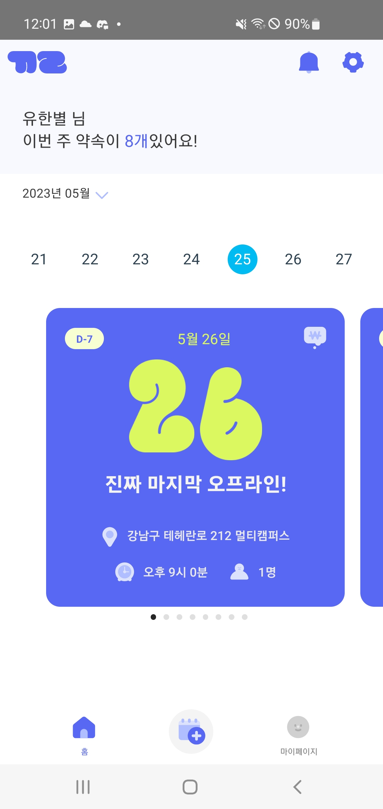
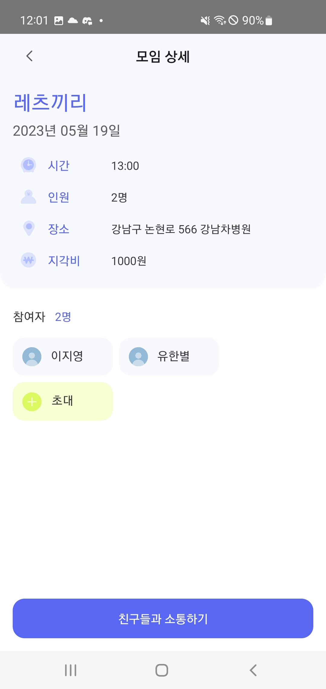
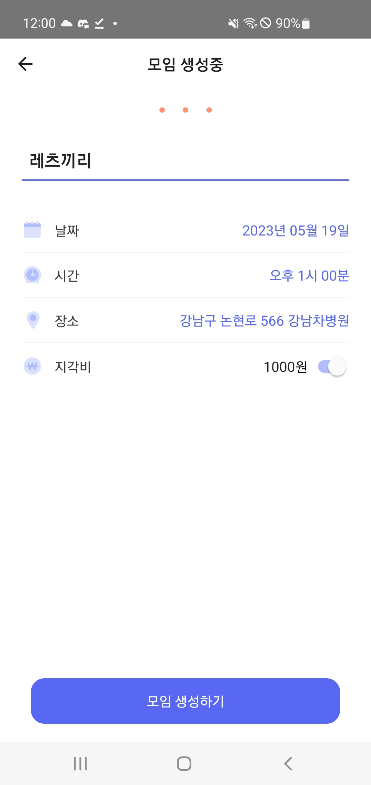
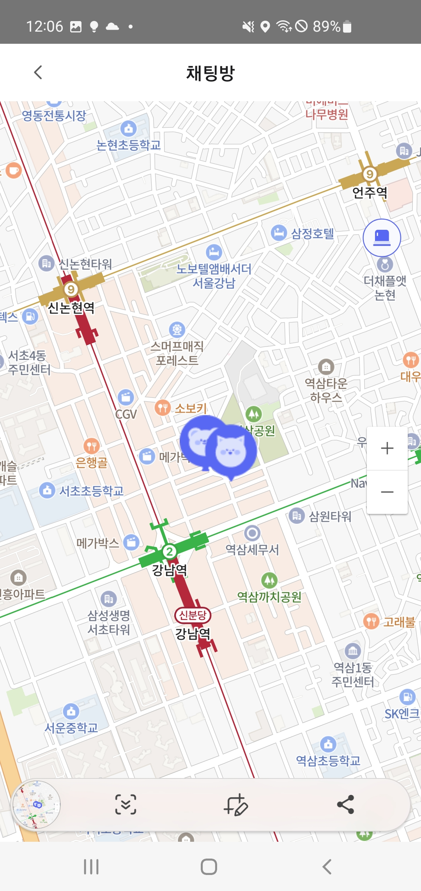
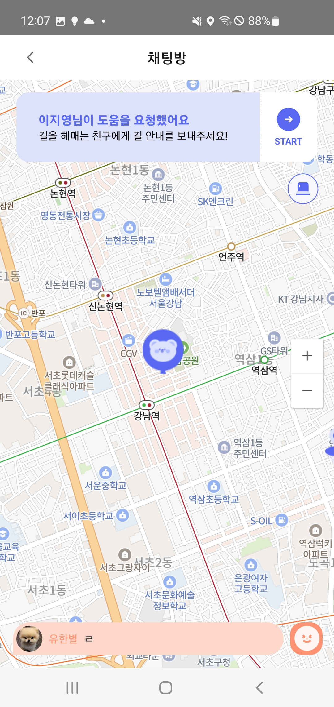

# 끼리(Let’s KKIRI) 포팅 매뉴얼


# 1. 개요

---

## 1.1. 프로젝트 소개

---

모임을 더 즐겁게

가는 길이 더 즐겁게

실시간 사용자 인터랙션을 더한 모임 관리 어플리케이션

## 1.2. 개발 환경

---

**형상관리**

- Gitlab

**협업도구**

- Discord
- Mattermost

**UI/UX**

- Figma

**이슈관리**

- Jira
- Notion

**IDE**

- Visual Studio Code 1.75
- IntelliJ IDEA 2022.3.1
- DataGrip 2022.3.2

**Database**

- MariaDB 10.11.2
- Redis 7.0.10
- MongoDB 6.0.6
- Firebase 9.1.1
- AWS S3 1.12.232

**Front-end**

- React-Native 0.65.1
- React 17.0.2
- Node.js 16.19.1
- Android 11.0(R)

**Back-end**

- JAVA JDK 11.0.9
- SpringBoot Gradle 2.7.11
    - Spring Data JPA
    - Spring Security
    - Lombok
    - WebSocket

## 1.3. 외부 서비스 및 문서

---

### 지도 : NAVER Maps

실시간 위치 공유 및 AR

[NAVER Maps API v3](https://navermaps.github.io/maps.js/)

### 로그인 : Kakao Developers

카카오 소셜 로그인

[Kakao Developers](https://developers.kakao.com/docs/latest/ko/kakaologin/rest-api)

## 1.4. `.gitignore` 처리한 핵심 키 파일

---

### **Spring Boot**

- `application.yml` : Spring Boot Application 설정 파일

# 2. 빌드

---

## 2.1. 환경 변수 형태

---

### 2.1.1. Spring Boot: `application.yml`

```makefile
spring:
  datasource:
    username: 
    password: 
  data:
    mongodb:
      uri: 
  security:
    oauth2:
      client:
        registration:
          kakao:
            client-id: 
            redirect-uri: 
            authorization-grant-type: 
            client-authentication-method: 
            scope: 
        provider:
          kakao:
            authorization-uri: 
            token-uri: 
            user-info-uri: 
            user-name-attribute: 
  redis:
    password: 
    host: 
    port: 

firebase:
  project:
    id: 
  config:
    path: 
  scope: 
  send:
    url: 

jwt:
  secret:
  expiration:
    atk:
    rtk:

cloud:
  aws:
    s3:
      region: 
      bucket: 
      credentials:
        access-key: 
        secret-key: 

clova:
  ocr:
    secret: 
    APIGW: 
```

## 2.2. 빌드하기

---

### 2.2.1. 백엔드: Spring

```bash
./gradlew clean build --exclude-task test
```

## 2.3. 배포하기

---

### 2.3.1. Docker 이미지

도커 이미지를 사용하면 아래 과정을 거치지 않아도 됩니다.

```bash
docker pull evekristin/kkiri-service:api
```

### 2.3.2. `docker-compose.yml`

```bash
version: "3.1"

services:
        proxy:
                image: nginx
                container_name: proxy
                depends_on:
                        - kkiri-service
                volumes:
                        - ./proxy/conf.d:/etc/nginx/conf.d
                        - ./proxy/nginx.conf:/etc/nginx/nginx.conf
                        - /etc/letsencrypt:/etc/letsencrypt
                ports:
                        - "443:443"
                        - "80:80"
                environment:
                        TZ: "Asia/Seoul"
        mariadb:
                container_name: mariadb
                image: mariadb
                environment:
                        MYSQL_DATABASE: 
                        MYSQL_USER: 
                        MYSQL_PASSWORD: 
                        MYSQL_ROOT_PASSWORD:
                        TZ: "Asia/Seoul"
                command:
                        - --character-set-server=utf8mb4
                        - --collation-server=utf8mb4_unicode_ci
                volumes:
                        - /var/lib/docker/volumes/mariadb/_data:/var/lib/mysql
                ports:
                        - "3306:3306"
                restart: always
        redis:
                container_name: redis
                image: redis
                ports:
                        - "6379:6379"
                command: redis-server --requirepass 
                volumes:
                        - /var/lib/docker/volumes/redis/_data:/data
                hostname: kkiri
                environment:
                        TZ: "Asia/Seoul"
        jenkins:
                container_name: jenkins
                image: jenkins/jenkins:lts
                privileged: true
                restart: always
                ports:
                        - "9090:8080"
                expose:
                        - 50000
                volumes:
                        - '/var/lib/docker/volumes/jenkins/_data:/var/jenkins_home'
                        - '/var/run/docker.sock:/var/run/docker.sock'
                        - '/usr/bin/docker:/usr/bin/docker'
                user: root
                environment:
                        TZ: "Asia/Seoul"
        kkiri-service:
                container_name: kkiri-service
                build: ./kkiri-be
                ports:
                        - "8080:8080"
                depends_on :
                        - mariadb
                        - redis
                environment:
                        TZ: "Asia/Seoul"
                restart: always
```

### 2.3.3. Spring Container: `Dockerfile`

`docker build -t evekristin/kkiri-service:api .`

`docker run -d -p 8080:8080 --name kkiri-service evekristin/kkiri-service:api`

```bash
FROM gradle:jdk11 as builder
  
ENV APP_HOME=/apps

WORKDIR $APP_HOME

COPY build.gradle settings.gradle $APP_HOME/
COPY src $APP_HOME/src

ENV TZ=Asia/Seoul

RUN gradle clean build -x test

FROM openjdk:11-jdk

ENV APP_HOME=/apps
ARG JAR_FILE_PATH=build/libs/kkiri-0.0.1-SNAPSHOT.jar

WORKDIR $APP_HOME
COPY --from=builder $APP_HOME/$JAR_FILE_PATH app.jar

EXPOSE 8080

ENTRYPOINT ["java", "-jar", "app.jar"]
```

### 2.3.4. Nginx : `conf.d/default.conf`

```yaml
upstream kkiri-service {
        server k8a606.p.ssafy.io:8080;
}

server {
        location /{
                proxy_pass http://kkiri-service;
        }

        location /api{
                proxy_pass http://kkiri-service;
        }
        
        location ~ ^/api(swagger|webjars|configuration|swagger-resources|v2|csrf) {
                proxy_pass http://kkiri-service;
                proxy_set_header Host $host;
                proxy_set_header X-Real-IP $remote_addr;
                proxy_set_header X-Forwarded-For $proxy_add_x_forwarded_for;
                proxy_set_header X-Forwarded-Proto $scheme;
                proxy_set_header Authorization $auth_header;
        }

        location /ws{
                proxy_pass http://kkiri-service;

                proxy_http_version 1.1;
                proxy_set_header Host $host;
                proxy_set_header Upgrade $http_upgrade;
                proxy_set_header Connection "upgrade";

                proxy_read_timeout 3600000s; #통신없어도 최대 1시간까지 유지
                proxy_send_timeout 3600000s;

        }
        listen 443 ssl;
        ssl_certificate /etc/letsencrypt/live/k8a606.p.ssafy.io/fullchain.pem; 
        ssl_certificate_key /etc/letsencrypt/live/k8a606.p.ssafy.io/privkey.pem;
}
```

# 3. 시연 시나리오

## 3.1. 모임 생성

---







## 3.2. 위치 공유

---



## 3.3. 채팅

---

## 3.4. 길 안내

---



## 3.5. AR 길 안내

---

## 3.6. 알림

---

